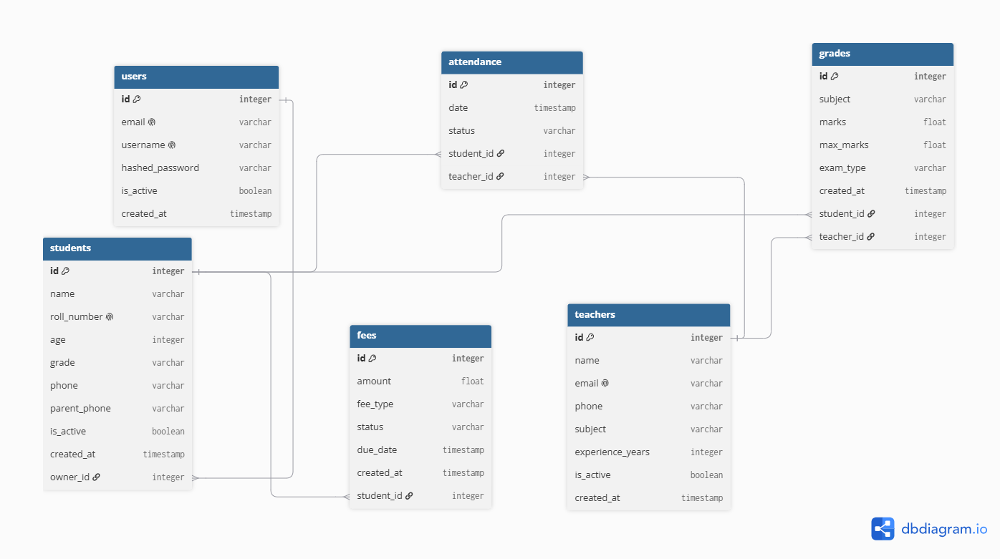
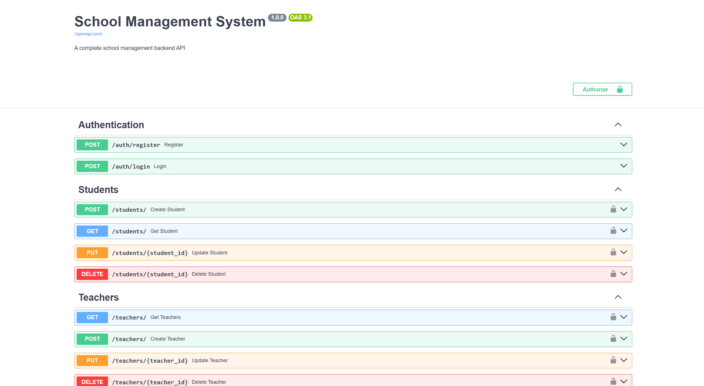

# 🎓 School Management System

A complete school management backend API built with FastAPI and PostgreSQL.

---

## 🚀 What This Project Does

- Register and login securely
- Manage students with grade filtering
- Manage teachers with subjects
- Mark and track student attendance
- Record grades for multiple subjects and exams
- Manage student fees and payment tracking

---

## 🧠 What I Learned Building This

- Student and teacher relationship management
- Attendance tracking system
- Grade recording and retrieval
- Fee management with status tracking
- Grade-based filtering
- Roll number uniqueness validation

---

## 🛠️ Tech Stack

| Technology | Purpose |
|------------|---------|
| Python 3.14 | Programming language |
| FastAPI | Web framework |
| PostgreSQL | Database |
| SQLAlchemy | ORM |
| Alembic | Migrations |
| PyJWT | Authentication |
| bcrypt | Password hashing |
| Docker | Containerization |
| Uvicorn | Server |

---

## ⚙️ How To Run

### Without Docker:
```bash
git clone https://github.com/sivamani151dev-cell/school-management.git
cd school-management
python -m venv venv
venv\Scripts\activate
pip install -r requirements.txt
python -m alembic upgrade head
uvicorn app.main:app --reload
```

### With Docker:
```bash
docker-compose up --build
```

---

## 📡 API Endpoints

### Authentication
| Method | Endpoint | Description | Auth |
|--------|----------|-------------|------|
| POST | `/auth/register` | Register | ❌ |
| POST | `/auth/login` | Login | ❌ |

### Students
| Method | Endpoint | Description | Auth |
|--------|----------|-------------|------|
| POST | `/students/` | Add student | ✅ |
| GET | `/students/` | Get all students | ✅ |
| GET | `/students/?grade=10th` | Filter by grade | ✅ |
| GET | `/students/{id}` | Get student | ✅ |
| PUT | `/students/{id}` | Update student | ✅ |
| DELETE | `/students/{id}` | Delete student | ✅ |

### Teachers
| Method | Endpoint | Description | Auth |
|--------|----------|-------------|------|
| POST | `/teachers/` | Add teacher | ✅ |
| GET | `/teachers/` | Get all teachers | ✅ |
| GET | `/teachers/{id}` | Get teacher | ✅ |
| PUT | `/teachers/{id}` | Update teacher | ✅ |
| DELETE | `/teachers/{id}` | Delete teacher | ✅ |

### Attendance
| Method | Endpoint | Description | Auth |
|--------|----------|-------------|------|
| POST | `/attendance/` | Mark attendance | ✅ |
| GET | `/attendance/student/{id}` | Student attendance | ✅ |

### Grades
| Method | Endpoint | Description | Auth |
|--------|----------|-------------|------|
| POST | `/grades/` | Add grade | ✅ |
| GET | `/grades/student/{id}` | Student grades | ✅ |

### Fees
| Method | Endpoint | Description | Auth |
|--------|----------|-------------|------|
| POST | `/fees/` | Create fee | ✅ |
| GET | `/fees/student/{id}` | Student fees | ✅ |
| PUT | `/fees/{id}` | Update status | ✅ |

---

## 📊 Database Schema



---

## 📸 Screenshots



---

## 🎯 Project Type
Client-Ready Project — built to demonstrate complete school administration capabilities.